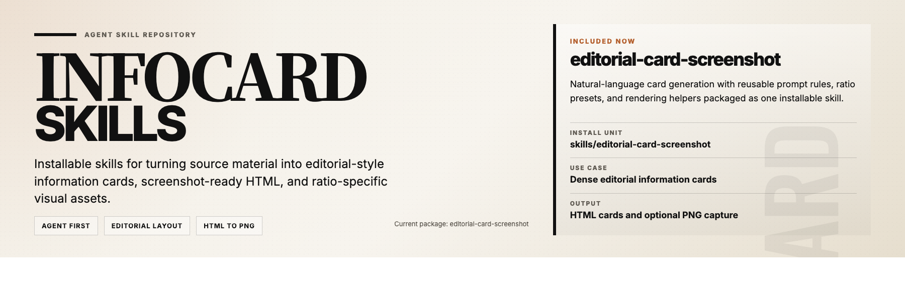

[中文](./README.zh-CN.md)

# infocard-skills

Open-source agent skills for generating editorial-style information cards from natural-language input.



`infocard-skills` is a small repository of installable skill packages for agents. The current package, `editorial-card-screenshot`, turns source material into screenshot-ready HTML cards and optional PNG outputs.

## Install

Install the full skill package, not a single file:

- [`skills/editorial-card-screenshot`](./skills/editorial-card-screenshot)

Copy or install the entire directory into your agent's skills location. Keep these files together:

- `SKILL.md`
- `assets/`
- `references/`
- `scripts/`
- `agents/` when supported by the host

## Verify

After installation, test with one of these prompts:

- `Use $editorial-card-screenshot to turn these notes into an editorial info card.`
- `Use $editorial-card-screenshot to make a 3:4 information card from this text.`
- `Use $editorial-card-screenshot and give me both the HTML and PNG.`

## Usage

Typical requests:

- `Turn this article into an editorial information card.`
- `Make a portrait 3:4 info card from these notes.`
- `Summarize this content as a dense magazine-style card.`
- `Create the HTML only. I do not need the image.`

## Render Requirement

For PNG capture, the current helper expects local Google Chrome at:

```text
/Applications/Google Chrome.app/Contents/MacOS/Google Chrome
```

## Repository

```text
skills/
  editorial-card-screenshot/
docs/
examples/
```

## Docs

- [`docs/agent-usage.md`](./docs/agent-usage.md)
- [`docs/editorial-card-prompt.md`](./docs/editorial-card-prompt.md)
- [`docs/project-overview.md`](./docs/project-overview.md)
- [`docs/github-metadata.md`](./docs/github-metadata.md)

## License

[MIT](./LICENSE)
